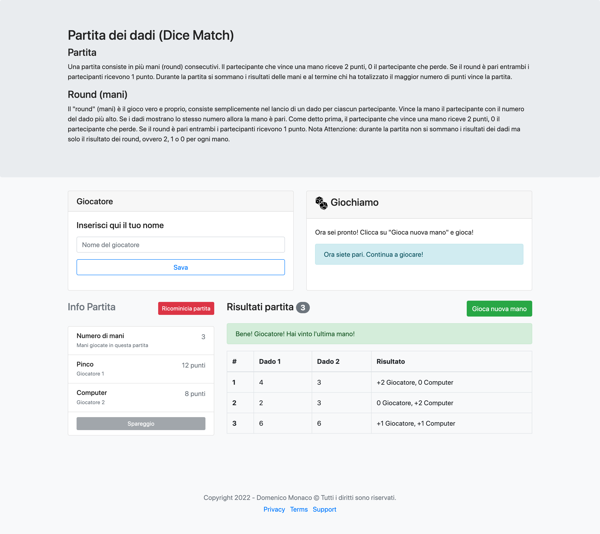

# Template HTML Gioco dei Dadi

### Sponsored by

 

 ## Prerequsiti

* node > 14
* npm > 6

### Advanced Usage

Clone the source files of the theme and navigate into the theme's root directory. Run `npm install` and then run `npm start` which will open up a preview of the template in your default browser, watch for changes to core template files, and live reload the browser when changes are saved. You can view the `package.json` file to see which scripts are included.

#### npm Scripts
- `npm run build` builds the project - this builds assets, HTML, JS, and CSS into `dist`
- `npm run buil-prod` runs the project in production mode - this also builds assets, HTML, JS, and CSS into `dist`
- `npm run clean` deletes the `dist` directory to prepare for rebuilding the project
- `npm run clean-inst` deletes the `dist` and `node_modules` directories and `package-lock.json` file to prepare for reinstall from scratch the entire projects
- `npm run dev` runs the project in developing mode
- `npm watch` not launches a live preview but runs compiling and watches for changes made to files in `src`

You must have npm installed in order to use this build environment.

## preview

## Copyright and License

Copyright
Domenico Monaco [https://domenicomonaco.it](https://domenicomonaco.it) Code released under MIT License